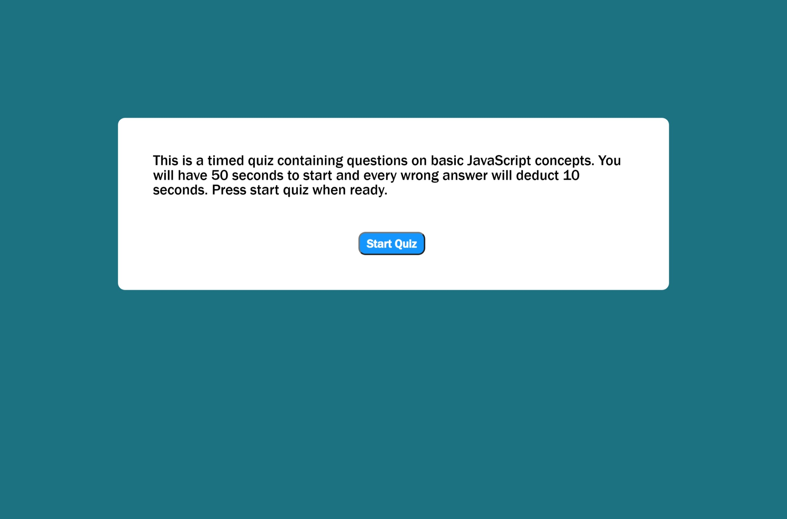

This is a Timed Quiz on Javascript concepts. Once the start button is pressed you will have 50 seconds to answer 5 questions. Every wrong answer will deduct 10 seconds. Once the timer hits 0 or all the questions have been answered you will be asked to input your innitials. on the following page you will see your initials and your score. You will then have the option to clear all your scores and or retake the quiz.

Deployed link here:https://adolfo-g.github.io/AG-Homework-4/

